# Comprehensive Report: Automated Role Permission Testing for Apache Superset

**Date:** 2026-03-03
**Author:** Automated testing via *REDACTED*

**Superset Instance:** http://localhost:8088

---

## Table of Contents

- [1. Objective](#1-objective)
  - [1.1 Role Definitions and Permission Listings](#11-role-definitions-and-permission-listings)
- [2. Test Environment Setup](#2-test-environment-setup)
  - [2.1 Roles Under Test](#21-roles-under-test)
  - [2.2 Test Users Created](#22-test-users-created)
  - [2.3 Test Objects Created](#23-test-objects-created)
  - [2.4 Ownership Configuration](#24-ownership-configuration)
- [3. Test Methodology](#3-test-methodology)
  - [3.1 Automated API Testing](#31-automated-api-testing)
  - [3.2 Visual UI Testing](#32-visual-ui-testing)
  - [3.3 Categories Tested](#33-categories-tested)
- [4. Results Summary](#4-results-summary)
  - [4.1 Overall](#41-overall)
  - [4.2 Results by Category](#42-results-by-category)
- [5. Visual Evidence — Key UI Differences](#5-visual-evidence--key-ui-differences)
  - [5.1 Navigation Menu](#51-navigation-menu)
  - [5.2 Dashboard List Visibility](#52-dashboard-list-visibility)
  - [5.3 SQL Lab Access](#53-sql-lab-access)
  - [5.4 Chart List](#54-chart-list)
  - [5.5 Dashboard View Comparison](#55-dashboard-view-comparison)
  - [5.6 Dataset List](#56-dataset-list)
  - [5.7 Admin — Role Configuration](#57-admin--role-configuration)
- [6. Detailed Test Results](#6-detailed-test-results)
  - [6.1 Dashboards (18 tests)](#61-dashboards-18-tests--17-passed)
  - [6.2 Dashboard Visibility (11 tests)](#62-dashboard-visibility-11-tests--all-passed)
  - [6.3 Datasets (10 tests)](#63-datasets-10-tests--9-passed)
  - [6.4 Charts (12 tests)](#64-charts-12-tests--11-passed)
  - [6.5 SQL Lab (6 tests)](#65-sql-lab-6-tests--all-passed)
  - [6.6 Tags (4 tests)](#66-tags-4-tests--all-passed)
  - [6.7 Databases (4 tests)](#67-databases-4-tests--all-passed)
- [7. Findings](#7-findings)
  - [Finding 1: Owner CAN Delete Owned Dashboards](#finding-1-owner-can-delete-owned-dashboards)
  - [Finding 2: Dataset Duplicate Returns Server Error](#finding-2-dataset-duplicate-returns-server-error)
  - [Finding 3: Owner CAN Delete Owned Charts](#finding-3-owner-can-delete-owned-charts)
- [8. Artifacts](#8-artifacts)
- [9. Recommendations](#9-recommendations)
- [10. How to Reproduce](#10-how-to-reproduce)

---

## 1. Objective

Validate that two custom Superset roles — **Sublime Starter** (viewer) and **Sublime User Management** (owner) — enforce the permission boundaries defined in the original Polish requirements document. The reference specification is stored in `superset/config/role-backups/superset-role-permissions-report.md`.

### 1.1 Role Definitions and Permission Listings

#### Design Decisions

1. **Dataset management (Option 1):** Neither role has `can_write Dataset`. All dataset changes are performed by Jupyter notebook automation.
2. **Dashboard deletion excluded:** Both roles lack delete permissions for dashboards. Deletion is handled by the external "maszynka" (Jupyter notebook).
3. **Chart deletion excluded:** Neither role can delete charts from UI. Charts are managed through the dashboard lifecycle.
4. **Owner-scoped editing:** `can_write Dashboard` only allows editing dashboards where the user is listed as an owner.
5. **SQL Lab for Owner only:** Restricted to Owner role to prevent uncontrolled queries by viewer users.
6. **Datasource-level access control:** Both roles use explicit `datasource_access` grants per dataset rather than broad `all_datasource_access`.

#### Navigation Menu Access

| Menu Item | Sublime Starter | Sublime User Management |
|-----------|:-:|:-:|
| Home | Y | Y |
| Dashboards | Y | Y |
| Charts | Y | Y |
| Datasets | Y | Y |
| Databases | Y | Y |
| Data | Y | Y |
| Tags | Y | Y |
| SQL Lab | - | Y |
| SQL Editor | - | Y |
| Saved Queries | - | Y |
| Query Search | - | Y |
| Action Log | - | Y |
| Themes | - | Y |

#### Permission Matrix by Object

**Dashboards**

| Capability | Starter | Owner | Superset Permission |
|-----------|:-:|:-:|-------|
| View dashboards | Y | Y | `can_read Dashboard` |
| Copy / Save as | Y | Y | Via `can_explore`, `can_slice` |
| Export / Download | Y | Y | `can_export Dashboard` |
| Edit (when owner) | - | Y | `can_write Dashboard` |
| Assign owners | - | Y | Via `can_write Dashboard` |
| Publish / Draft toggle | - | Y | Via `can_write Dashboard` |
| Tag dashboards | - | Y | `can_tag Dashboard` |
| Set/Delete embedded | - | Y | `can_set_embedded`, `can_delete_embedded` |
| Delete dashboard | - | - | Blocked on both; handled by notebook |
| Drill into data | Y | Y | `can_drill Dashboard` |
| View chart as table | Y | Y | `can_view_chart_as_table Dashboard` |
| View underlying query | Y | Y | `can_view_query Dashboard` |
| Cache screenshot | Y | Y | `can_cache_dashboard_screenshot Dashboard` |
| Share dashboard link | Y | Y | `can_share_dashboard Superset` |
| Filter state (read/write) | Y | Y | `DashboardFilterStateRestApi` |
| Permalink (read/write) | Y | Y | `DashboardPermalinkRestApi` |

**Charts**

| Capability | Starter | Owner | Superset Permission |
|-----------|:-:|:-:|-------|
| View charts | Y | Y | `can_read Chart` |
| Export charts | Y | Y | `can_export Chart` |
| Create new charts | - | Y | `can_write Chart` |
| Save as copy | Y | Y | Via explore + slice |
| Edit (when owner) | - | Y | `can_write Chart` |
| Tag charts | - | Y | `can_tag Chart` |
| Warm up cache | - | Y | `can_warm_up_cache Chart` |
| Share chart link | Y | Y | `can_share_chart Superset` |
| Delete charts | - | - | Blocked on both |

**Datasets (Option 1 — Managed by Notebook)**

| Capability | Starter | Owner | Superset Permission |
|-----------|:-:|:-:|-------|
| View datasets | Y | Y | `can_read Dataset` |
| Drill info | Y | Y | `can_get_drill_info Dataset` |
| Edit datasets | - | - | Blocked — Option 1 |
| Create datasets | - | - | Blocked — Option 1 |
| Duplicate datasets | - | Y | `can_duplicate Dataset` |
| Export datasets | - | Y | `can_export Dataset` |
| Get/Create dataset ref | - | Y | `can_get_or_create_dataset` |
| Warm up cache | - | Y | `can_warm_up_cache Dataset` |
| View column values | - | Y | `can_get_column_values Datasource` |
| View samples | - | Y | `can_samples Datasource` |

**Databases**

| Capability | Starter | Owner | Superset Permission |
|-----------|:-:|:-:|-------|
| View databases | Y | Y | `can_read Database` |
| Edit databases | - | - | Blocked on both |
| Upload to database | - | - | Blocked on both |

**SQL Lab**

| Capability | Starter | Owner | Superset Permission |
|-----------|:-:|:-:|-------|
| Access SQL Lab | - | Y | `can_sqllab Superset` |
| Execute queries | - | Y | `can_execute_sql_query SQLLab` |
| Format SQL | - | Y | `can_format_sql SQLLab` |
| Export CSV | - | Y | `can_export_csv SQLLab` |
| Estimate query cost | - | Y | `can_estimate_query_cost SQLLab` |
| View results | - | Y | `can_get_results SQLLab` |
| Query history | - | Y | `can_sqllab_history Superset` |
| Saved queries (read) | Y | Y | `can_read SavedQuery` |
| Saved queries (write) | - | Y | `can_write SavedQuery` |
| Saved queries (export) | - | Y | `can_export SavedQuery` |
| Tab state management | - | Y | `TabStateView` (activate, get, post, put, delete) |
| Table schema browser | - | Y | `TableSchemaView` (post, expanded, delete) |
| SQL Lab permalink | - | Y | `SqlLabPermalinkRestApi` |

**Tags**

| Capability | Starter | Owner | Superset Permission |
|-----------|:-:|:-:|-------|
| View tags | Y | Y | `can_read Tag`, `can_list Tags` |
| Create/Edit tags | - | Y | `can_write Tag`, `can_bulk_create Tag` |

**Explore / Visualization**

| Capability | Starter | Owner | Superset Permission |
|-----------|:-:|:-:|-------|
| Explore view | Y | Y | `can_read Explore` |
| Explore JSON data | Y | Y | `can_explore_json Superset` |
| Form data (read/write) | Y | Y | `ExploreFormDataRestApi` |
| Permalink (read/write) | Y | Y | `ExplorePermalinkRestApi` |
| Fetch datasource metadata | Y | Y | `can_fetch_datasource_metadata Superset` |
| CSV export | Y | Y | `can_csv Superset` |

**User & Security**

| Capability | Starter | Owner | Superset Permission |
|-----------|:-:|:-:|-------|
| View own user info | Y | Y | `can_userinfo UserDBModelView` |
| Reset own password | Y | Y | `resetmypassword`, `ResetMyPasswordView` |
| Read security info | Y | Y | `can_read security`, `SecurityRestApi` |
| Read user info | Y | Y | `can_read user` |
| Write current user | - | Y | `can_write CurrentUserRestApi` |
| View audit log | - | Y | `can_read Log`, `menu_access Action Log` |
| Row level security (read) | Y | Y | `can_read RowLevelSecurity` |

**Themes**

| Capability | Starter | Owner | Superset Permission |
|-----------|:-:|:-:|-------|
| View themes | Y | Y | `can_read Theme` |
| Edit themes | - | Y | `can_write Theme` |
| Export themes | - | Y | `can_export Theme` |

#### Complete Raw Permission Lists

**Sublime Starter — 72 permissions:**

| # | Permission | View/Resource |
|--:|-----------|---------------|
| 1 | `can_read` | AdvancedDataType |
| 2 | `can_query` | Api |
| 3 | `can_query_form_data` | Api |
| 4 | `can_time_range` | Api |
| 5 | `can_list` | AsyncEventsRestApi |
| 6 | `can_read` | AvailableDomains |
| 7 | `can_export` | Chart |
| 8 | `can_read` | Chart |
| 9 | `menu_access` | Charts |
| 10 | `can_read` | CurrentUserRestApi |
| 11 | `can_cache_dashboard_screenshot` | Dashboard |
| 12 | `can_drill` | Dashboard |
| 13 | `can_export` | Dashboard |
| 14 | `can_get_embedded` | Dashboard |
| 15 | `can_read` | Dashboard |
| 16 | `can_view_chart_as_table` | Dashboard |
| 17 | `can_view_query` | Dashboard |
| 18 | `can_read` | DashboardFilterStateRestApi |
| 19 | `can_write` | DashboardFilterStateRestApi |
| 20 | `can_read` | DashboardPermalinkRestApi |
| 21 | `can_write` | DashboardPermalinkRestApi |
| 22 | `menu_access` | Dashboards |
| 23 | `menu_access` | Data |
| 24 | `can_read` | Database |
| 25 | `menu_access` | Databases |
| 26 | `can_get_drill_info` | Dataset |
| 27 | `can_read` | Dataset |
| 28 | `menu_access` | Datasets |
| 29 | `can_external_metadata` | Datasource |
| 30 | `can_external_metadata_by_name` | Datasource |
| 31 | `can_get` | Datasource |
| 32 | `can_read` | EmbeddedDashboard |
| 33 | `can_read` | Explore |
| 34 | `can_read` | ExploreFormDataRestApi |
| 35 | `can_write` | ExploreFormDataRestApi |
| 36 | `can_read` | ExplorePermalinkRestApi |
| 37 | `can_write` | ExplorePermalinkRestApi |
| 38 | `menu_access` | Home |
| 39 | `can_recent_activity` | Log |
| 40 | `can_get` | MenuApi |
| 41 | `can_get` | OpenApi |
| 42 | `can_this_form_get` | ResetMyPasswordView |
| 43 | `can_this_form_post` | ResetMyPasswordView |
| 44 | `can_read` | RowLevelSecurity |
| 45 | `can_list` | SavedQuery |
| 46 | `can_read` | SavedQuery |
| 47 | `can_read` | SecurityRestApi |
| 48 | `can_csv` | Superset |
| 49 | `can_dashboard` | Superset |
| 50 | `can_dashboard_permalink` | Superset |
| 51 | `can_explore` | Superset |
| 52 | `can_explore_json` | Superset |
| 53 | `can_fetch_datasource_metadata` | Superset |
| 54 | `can_language_pack` | Superset |
| 55 | `can_log` | Superset |
| 56 | `can_share_chart` | Superset |
| 57 | `can_share_dashboard` | Superset |
| 58 | `can_slice` | Superset |
| 59 | `can_read` | Tag |
| 60 | `can_tags` | TagView |
| 61 | `can_list` | Tags |
| 62 | `menu_access` | Tags |
| 63 | `can_read` | Theme |
| 64 | `can_userinfo` | UserDBModelView |
| 65 | `resetmypassword` | UserDBModelView |
| 66 | `datasource_access` | [PostgreSQL].[daily_trip_summary](id:4) |
| 67 | `datasource_access` | [PostgreSQL].[payment_type_breakdown](id:3) |
| 68 | `schema_access` | [PostgreSQL].[playground].[nyc_taxi] |
| 69 | `datasource_access` | [PostgreSQL].[trips_by_borough](id:2) |
| 70 | `datasource_access` | [PostgreSQL].[trips_by_hour](id:1) |
| 71 | `can_read` | security |
| 72 | `can_read` | user |

**Sublime User Management — 120 permissions (48 additional over Starter):**

The Owner role includes all 72 Starter permissions plus 48 additional permissions. Below are the **additional permissions only** (not present in Sublime Starter):

| # | Permission | View/Resource | Category |
|--:|-----------|---------------|----------|
| 1 | `menu_access` | Action Log | Audit |
| 2 | `can_invalidate` | CacheRestApi | Cache |
| 3 | `can_tag` | Chart | Charts |
| 4 | `can_warm_up_cache` | Chart | Charts |
| 5 | `can_write` | Chart | Charts |
| 6 | `can_write` | CurrentUserRestApi | User |
| 7 | `can_delete_embedded` | Dashboard | Dashboards |
| 8 | `can_set_embedded` | Dashboard | Dashboards |
| 9 | `can_tag` | Dashboard | Dashboards |
| 10 | `can_write` | Dashboard | Dashboards |
| 11 | `can_duplicate` | Dataset | Datasets |
| 12 | `can_export` | Dataset | Datasets |
| 13 | `can_get_or_create_dataset` | Dataset | Datasets |
| 14 | `can_warm_up_cache` | Dataset | Datasets |
| 15 | `can_get_column_values` | Datasource | Datasets |
| 16 | `can_samples` | Datasource | Datasets |
| 17 | `can_read` | Log | Audit |
| 18 | `menu_access` | Query Search | SQL Lab |
| 19 | `menu_access` | SQL Editor | SQL Lab |
| 20 | `menu_access` | SQL Lab | SQL Lab |
| 21 | `can_estimate_query_cost` | SQLLab | SQL Lab |
| 22 | `can_execute_sql_query` | SQLLab | SQL Lab |
| 23 | `can_export_csv` | SQLLab | SQL Lab |
| 24 | `can_format_sql` | SQLLab | SQL Lab |
| 25 | `can_get_results` | SQLLab | SQL Lab |
| 26 | `can_read` | SQLLab | SQL Lab |
| 27 | `menu_access` | Saved Queries | SQL Lab |
| 28 | `can_export` | SavedQuery | SQL Lab |
| 29 | `can_write` | SavedQuery | SQL Lab |
| 30 | `can_read` | SqlLabPermalinkRestApi | SQL Lab |
| 31 | `can_write` | SqlLabPermalinkRestApi | SQL Lab |
| 32 | `can_sqllab` | Superset | SQL Lab |
| 33 | `can_sqllab_history` | Superset | SQL Lab |
| 34 | `can_warm_up_cache` | Superset | Cache |
| 35 | `can_activate` | TabStateView | SQL Lab |
| 36 | `can_delete` | TabStateView | SQL Lab |
| 37 | `can_delete_query` | TabStateView | SQL Lab |
| 38 | `can_get` | TabStateView | SQL Lab |
| 39 | `can_post` | TabStateView | SQL Lab |
| 40 | `can_put` | TabStateView | SQL Lab |
| 41 | `can_delete` | TableSchemaView | SQL Lab |
| 42 | `can_expanded` | TableSchemaView | SQL Lab |
| 43 | `can_post` | TableSchemaView | SQL Lab |
| 44 | `can_bulk_create` | Tag | Tags |
| 45 | `can_write` | Tag | Tags |
| 46 | `can_export` | Theme | Themes |
| 47 | `can_write` | Theme | Themes |
| 48 | `menu_access` | Themes | Themes |

---

## 2. Test Environment Setup

### 2.1 Roles Under Test

| Role | ID | Purpose | Permission Count |
|------|----|---------|:---------------:|
| Sublime Starter | 6 | Viewer — read-only access with copy/save-as | 72 |
| Sublime User Management | 7 | Owner — full management of owned objects + SQL Lab | 120 |

### 2.2 Test Users Created

Users were created via Superset CLI inside the Docker container:

```bash
docker exec sql-playground-superset superset fab create-user \
  --username test-viewer --firstname Test --lastname Viewer \
  --email test-viewer@test.com --password testpass123 --role "Sublime Starter"

docker exec sql-playground-superset superset fab create-user \
  --username test-owner --firstname Test --lastname Owner \
  --email test-owner@test.com --password testpass123 --role "Sublime User Management"
```

| User | ID | Username | Password | Role |
|------|----|----------|----------|------|
| Viewer | 2 | test-viewer | testpass123 | Sublime Starter |
| Owner | 3 | test-owner | testpass123 | Sublime User Management |
| Admin | 1 | admin | admin123 | Admin (setup only) |

### 2.3 Test Objects Created

**4 Dashboards** covering Published/Draft x Owned/Not-owned combinations:

| Dashboard | ID | State | Admin | test-owner |
|-----------|----|-------|:-----:|:----------:|
| Test Dashboard 1 - Trip Patterns | 5 | Published | Owner | Owner |
| Test Dashboard 2 - Revenue Analysis | 2 | Published | Owner | - |
| Test Dashboard 1 - Trip Patterns (Draft) | 3 | Draft | Owner | Owner |
| Test Dashboard 2 - Revenue Analysis (Draft) | 4 | Draft | Owner | - |

**4 Charts** with mixed ownership:

| Chart | ID | Owned by test-owner |
|-------|----|:-------------------:|
| Trips by Hour of Day | 5 | Yes |
| Trips by Borough | 2 | Yes |
| Daily Trip Volume Trend | 3 | No |
| Payment Type Analysis | 4 | No |

Draft dashboards 3 and 4 were created specifically for testing Draft/Published visibility rules.

### 2.4 Ownership Configuration

Ownership was configured via Superset MCP tools:
- `update_dashboard_config` — set owners on Dashboard 5 (admin + test-owner)
- `update_chart` — set owners on Charts 2, 5 (admin + test-owner)

---

## 3. Test Methodology

### 3.1 Automated API Testing

A Python script (`superset/config/role-backups/test-role-permissions.py`) was created to test **65 permission boundaries** across 7 categories via Superset REST API:

1. **Authentication:** JWT tokens obtained via `POST /api/v1/security/login`
2. **Non-destructive approach:** PUT tests use reversible payloads (edit then revert). DELETE tests create temporary objects and attempt deletion on those — never on real dashboards/charts.
3. **Auto-detection:** Object IDs are auto-detected at runtime by querying ownership.
4. **Cleanup:** All test-created objects (temp dashboards, charts, tags, queries) are deleted via admin after testing.

### 3.2 Visual UI Testing


### 3.3 Categories Tested

| # | Category | Tests | Covers |
|---|----------|:-----:|--------|
| 1 | Dashboards | 18 | Edit, copy, delete, export, publish toggle (owned vs non-owned) |
| 1b | Dashboard Visibility | 11 | Draft/Published visibility for owners vs non-owners |
| 2 | Datasets | 10 | Read, edit, create, duplicate, export |
| 3 | Charts | 12 | View, create, edit, delete, export (owned vs non-owned) |
| 4 | SQL Lab | 6 | Execute SQL, save queries, read saved queries |
| 5 | Tags | 4 | Read tags, create tags |
| 6 | Databases | 4 | Read databases, edit databases |

---

## 4. Results Summary

### 4.1 Overall

| Metric | Value |
|--------|:-----:|
| Total tests | 65 |
| Passed | 62 |
| Failed (Findings) | 3 |
| Pass rate | **95.4%** |

### 4.2 Results by Category

| Category | Tests | Passed | Failed |
|----------|:-----:|:------:|:------:|
| Dashboards | 18 | 17 | 1 |
| Dashboard Visibility | 11 | 11 | 0 |
| Datasets | 10 | 9 | 1 |
| Charts | 12 | 11 | 1 |
| SQL Lab | 6 | 6 | 0 |
| Tags | 4 | 4 | 0 |
| Databases | 4 | 4 | 0 |

---

## 5. Visual Evidence — Key UI Differences

### 5.1 Navigation Menu

| Feature | Viewer (Sublime Starter) | Owner (Sublime User Management) |
|---------|--------------------------|--------------------------------|
| Top nav items | Dashboards, Charts, Datasets | Dashboards, Charts, Datasets, **SQL** |
| SQL Lab menu | Not visible | **Visible (SQL dropdown)** |
| + button | Not visible | **Visible** |
| + Dashboard button | Not visible | **Visible** |

**Viewer navigation** — only Dashboards, Charts, Datasets in nav bar. No SQL menu. No + button:

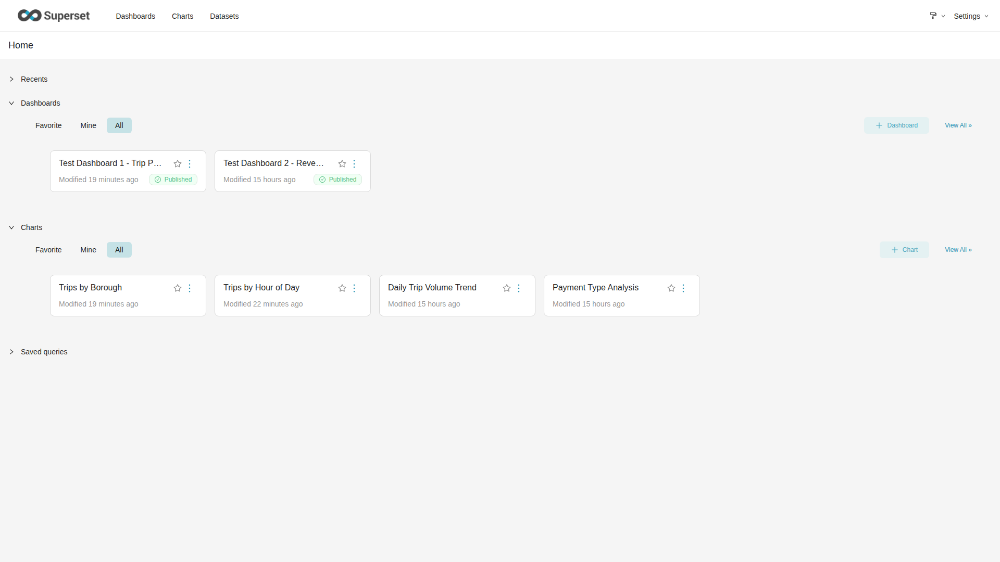

**Owner navigation** — Dashboards, Charts, Datasets, **SQL** dropdown in nav bar. **+ Dashboard** button visible top-right. Export button visible:

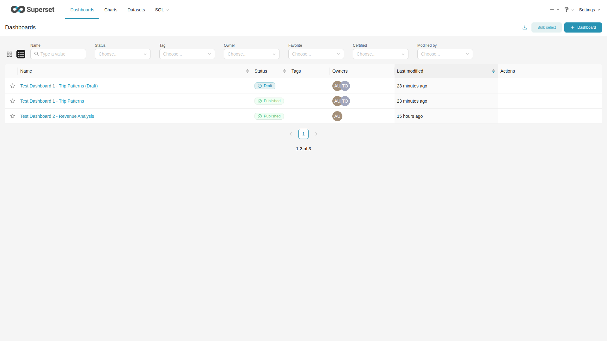

### 5.2 Dashboard List Visibility

| Dashboard | Viewer sees | Owner sees | Admin sees |
|-----------|:-----------:|:----------:|:----------:|
| Trip Patterns (Published) | Yes | Yes | Yes |
| Revenue Analysis (Published) | Yes | Yes | Yes |
| Trip Patterns Draft (Draft, owned) | **No** | **Yes** | Yes |
| Revenue Analysis Draft (Draft, not owned) | **No** | **No** | Yes |

**Viewer** — sees **2 dashboards** (both Published only). 1-2 of 2:

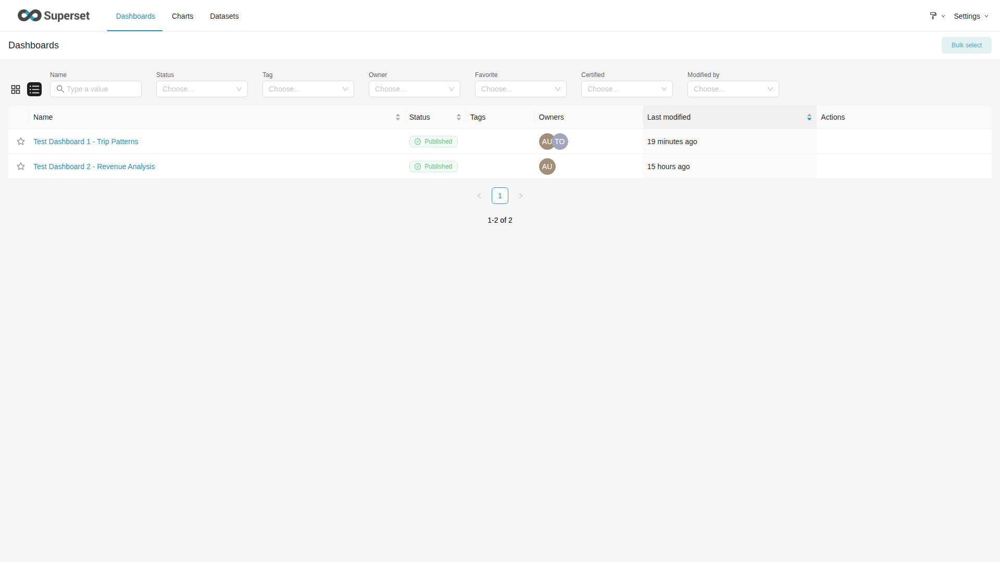

**Owner** — sees **3 dashboards** (2 Published + 1 owned Draft). 1-3 of 3:


**Admin** — sees **all 4 dashboards** (including both Drafts). 1-4 of 4:

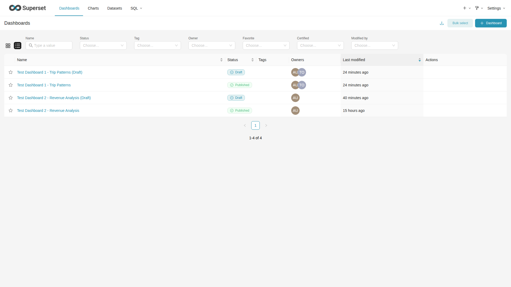

### 5.3 SQL Lab Access

**Viewer** — redirected to Home page with **"Access is Denied"** toast notification:

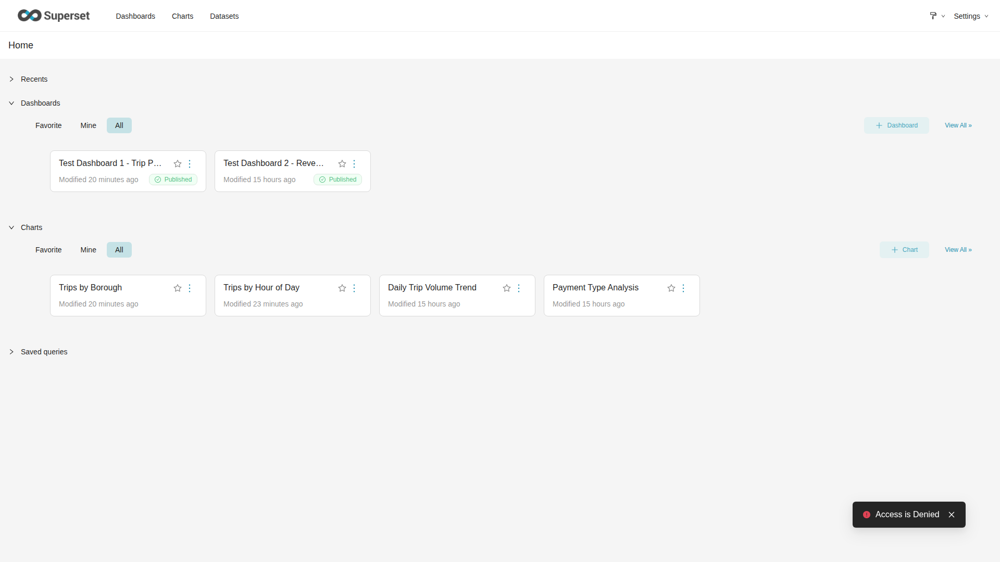

**Owner** — full SQL Lab interface with query editor, database selector (PostgreSQL), schema selector (nyc_taxi), Run button, Save button:

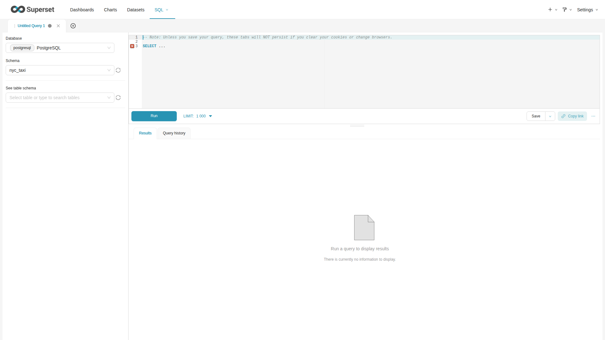

### 5.4 Chart List

**Viewer** — can see all charts, but no **+ Chart** button or bulk actions in the top-right:

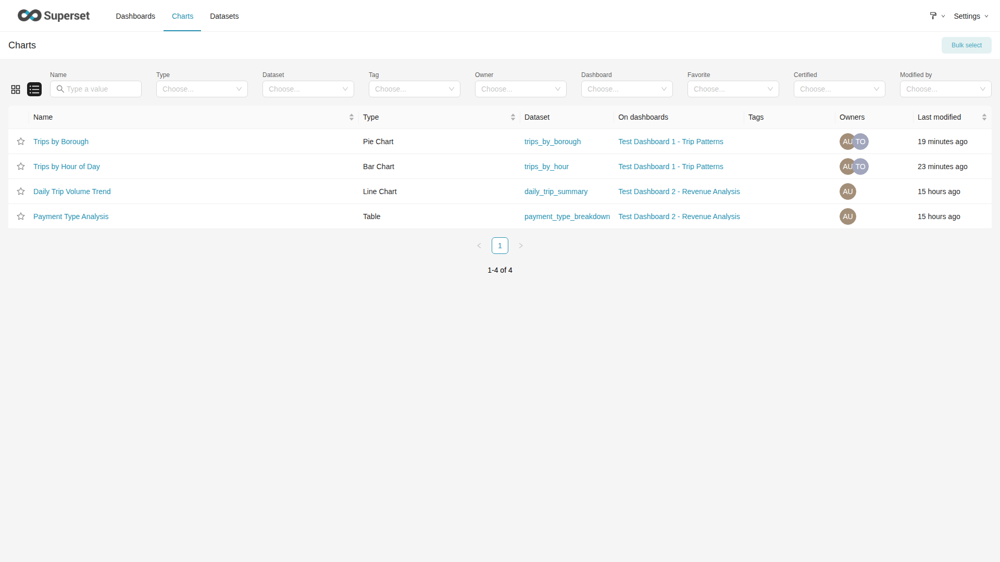

**Owner** — sees all charts with **+ Chart** button and full action controls:

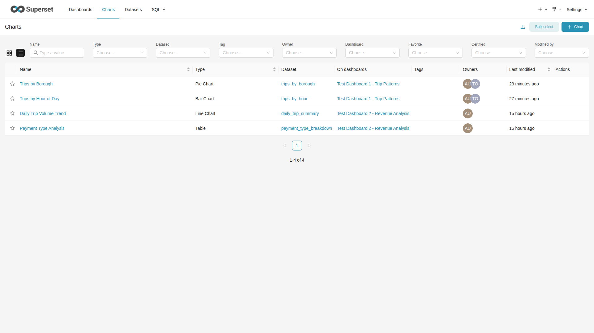

### 5.5 Dashboard View Comparison

The key permission differences between Viewer and Owner are clearly visible in the **navigation bar** and **dashboard controls**, regardless of chart loading state. Charts show "Waiting on database..." because the underlying datasets query 40M+ rows of NYC taxi data through Superset's synchronous execution mode — this is expected behavior for large datasets without Redis caching.

**Viewer** viewing Revenue Analysis dashboard — **read-only UI**, no edit controls:
- Navigation bar: `Dashboards | Charts | Datasets` only — **no SQL menu**, **no + button**
- No "Edit dashboard" button in top-right corner
- No "Published" badge (viewer cannot change publication status)

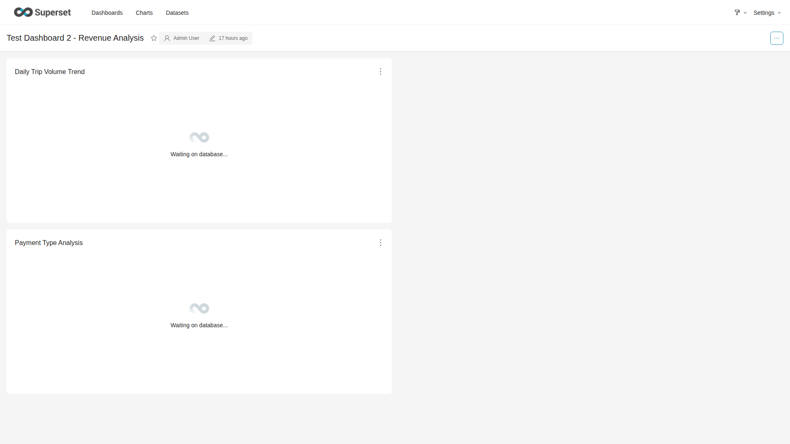

**Viewer** viewing Trip Patterns dashboard — same restrictions apply:

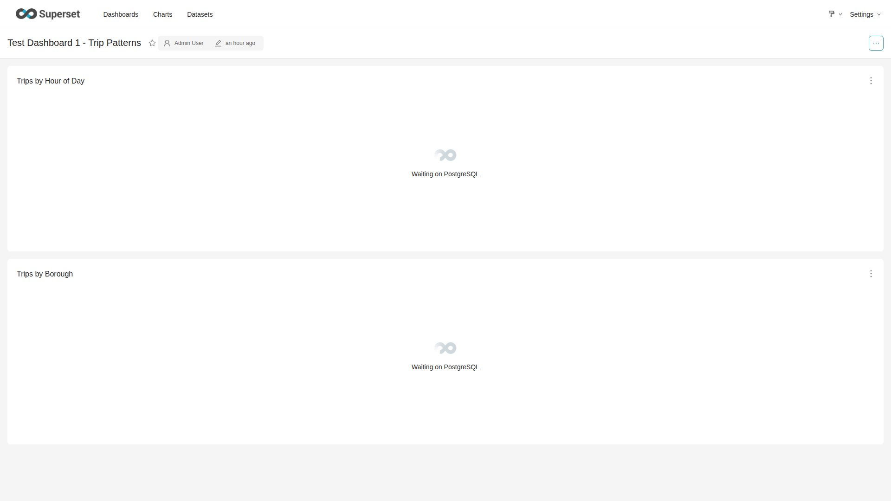

**Owner** viewing Revenue Analysis dashboard (non-owned) — **enhanced navigation**, but no edit on non-owned:
- Navigation bar: `Dashboards | Charts | Datasets | SQL` + **`+` create button**
- No "Edit dashboard" button (owner does NOT own this dashboard)


**Owner** viewing Trip Patterns dashboard (owned) — **full edit capabilities**:
- Navigation bar: `Dashboards | Charts | Datasets | SQL` + **`+` create button**
- **"Edit dashboard"** button visible in top-right corner (owner IS listed as owner)
- **"Published"** badge visible (owner can toggle draft/published)

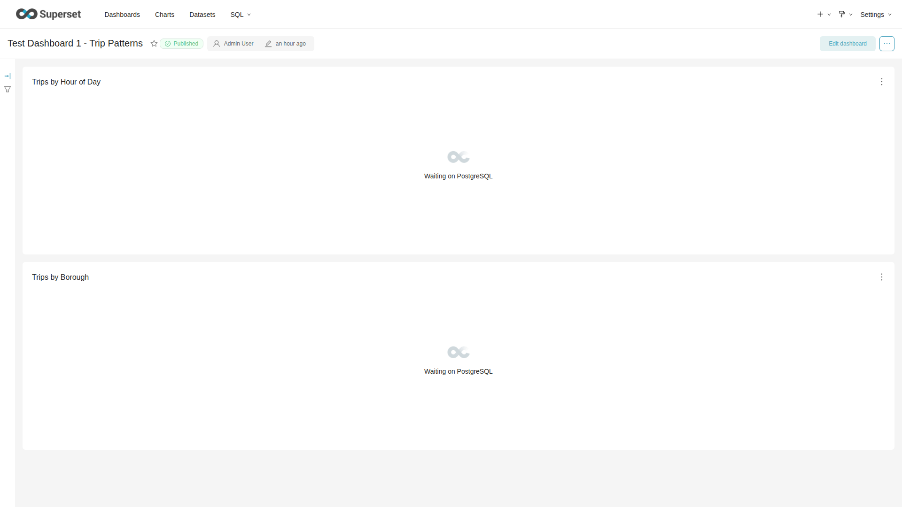

### 5.6 Dataset List

**Viewer** — read-only view of datasets:

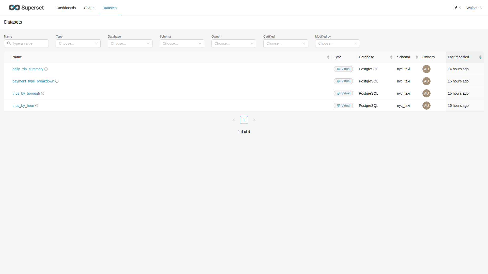

**Owner** — dataset list with additional action options:

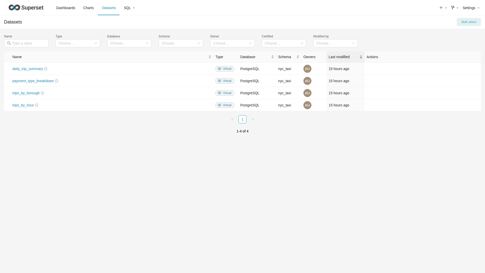

### 5.7 Admin — Role Configuration

**Users list** showing test users with role assignments:

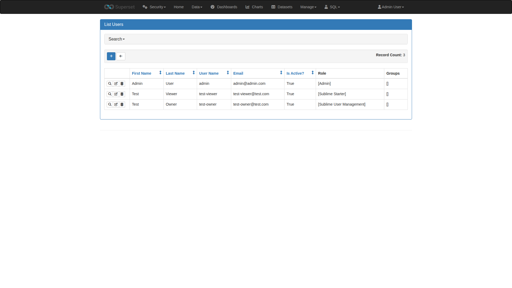

**Roles list** showing custom Sublime roles:

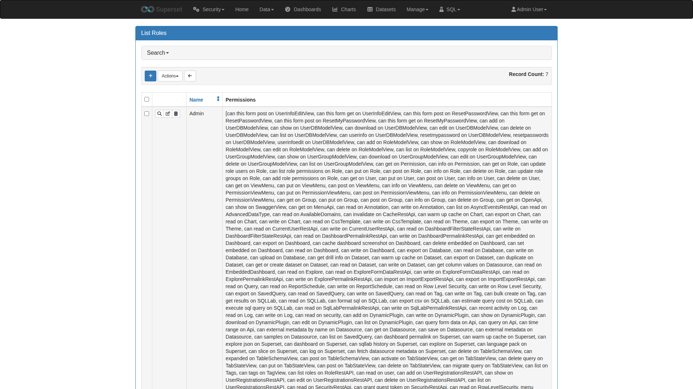

**Sublime Starter role** — 72 permissions (viewer):

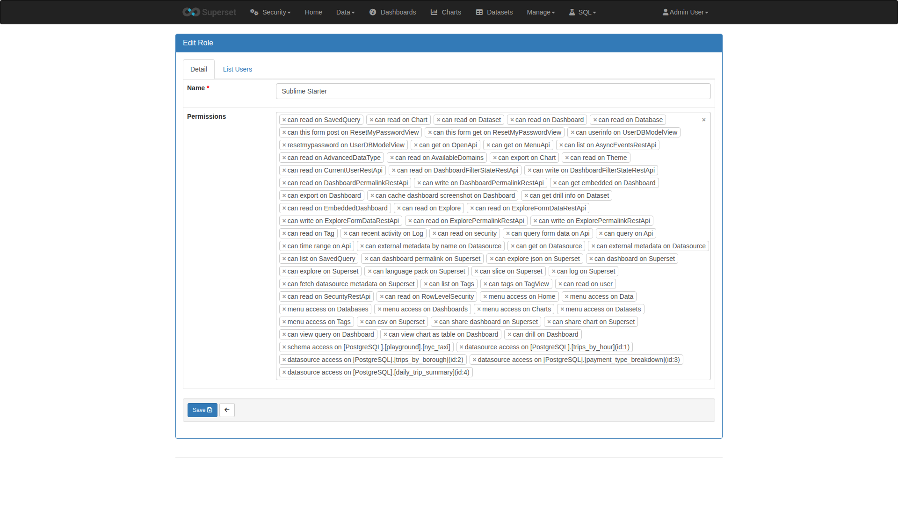

**Sublime User Management role** — 120 permissions (owner):

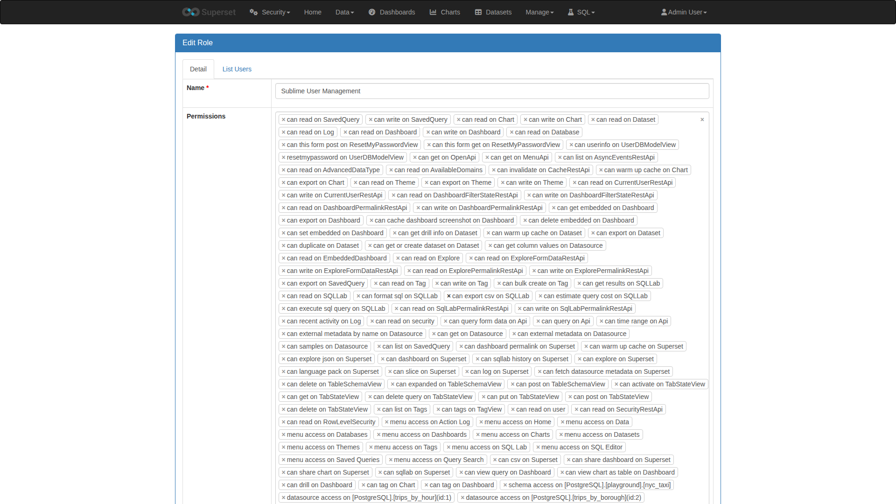

---

## 6. Detailed Test Results

### 6.1 Dashboards (18 tests — 17 passed)

| ID | Status | User | Description |
|:---|:------:|:-----|:------------|
| 1.1.1 | PASS | viewer | Non-owned: cannot edit (403) |
| 1.1.1 | PASS | owner | Non-owned: cannot edit (403) |
| 1.1.2 | PASS | viewer | Copy/Save as: blocked (403) — viewer lacks can_write Dashboard |
| 1.1.2 | PASS | owner | Copy/Save as: allowed (201) |
| 1.1.3 | PASS | viewer | Non-owned: cannot delete (403) |
| 1.1.3 | PASS | owner | Non-owned: cannot delete (404 — hidden) |
| 1.1.4 | PASS | viewer | Non-owned: can export (200) |
| 1.1.4 | PASS | owner | Non-owned: can export (200) |
| 1.2.1 | PASS | viewer | Owned: cannot edit (403) |
| 1.2.1 | PASS | owner | Owned: can edit (200) |
| 1.2.2 | PASS | viewer | Owned: cannot assign owner (403) |
| 1.2.2 | PASS | owner | Owned: can assign owner (200) |
| 1.2.3 | PASS | viewer | Owned: cannot delete (403) |
| 1.2.3 | **FAIL** | owner | **Owned: CAN delete (200) — see Finding 1** |
| 1.2.4 | PASS | viewer | Owned: cannot toggle published (403) |
| 1.2.4 | PASS | owner | Owned: can toggle published (200) |
| 1.2.5 | PASS | viewer | Non-owned: cannot toggle published (403) |
| 1.2.5 | PASS | owner | Non-owned: cannot toggle published (403) |

### 6.2 Dashboard Visibility (11 tests — all passed)

| ID | Status | User | Description |
|:---|:------:|:-----|:------------|
| 1.3.1 | PASS | viewer | Published dashboards visible (both) |
| 1.3.1 | PASS | owner | Published dashboards visible (both) |
| 1.3.2 | PASS | viewer | Owned Draft dashboard hidden from viewer |
| 1.3.2 | PASS | owner | Owned Draft dashboard visible to owner |
| 1.3.3 | PASS | viewer | Non-owned Draft hidden from viewer |
| 1.3.3 | PASS | owner | Non-owned Draft hidden from owner |
| 1.3.4 | PASS | owner | Can toggle owned Draft -> Published (200) |
| 1.3.5 | PASS | owner | Cannot toggle non-owned Draft (404 — hidden) |
| 1.3.6 | PASS | owner | Revert back to Draft (200) |

### 6.3 Datasets (10 tests — 9 passed)

| ID | Status | User | Description |
|:---|:------:|:-----|:------------|
| 2.1 | PASS | both | Cannot edit datasets (403) |
| 2.2 | PASS | both | Cannot create datasets (403) |
| 2.3 | PASS | both | Can read datasets (200) |
| 2.4 | PASS | viewer | Cannot duplicate datasets (403) |
| 2.4 | **FAIL** | owner | **Duplicate returns 500 — see Finding 2** |
| 2.5 | PASS | viewer | Cannot export datasets (403) |
| 2.5 | PASS | owner | Can export datasets (200) |

### 6.4 Charts (12 tests — 11 passed)

| ID | Status | User | Description |
|:---|:------:|:-----|:------------|
| 3.1 | PASS | both | Can view charts (200) |
| 3.3 | PASS | viewer | Cannot create charts (403) |
| 3.3 | PASS | owner | Can create charts (201) |
| 3.4 | PASS | viewer | Cannot edit owned charts (403) |
| 3.4 | PASS | owner | Can edit owned charts (200) |
| 3.5 | PASS | both | Cannot edit non-owned charts (403) |
| 3.6 | PASS | viewer | Cannot delete charts (403) |
| 3.6 | **FAIL** | owner | **Owned: CAN delete (200) — see Finding 3** |
| 3.7 | PASS | both | Can export charts (200) |

### 6.5 SQL Lab (6 tests — all passed)

| ID | Status | User | Description |
|:---|:------:|:-----|:------------|
| 4.1 | PASS | viewer | Cannot execute SQL (403) |
| 4.1 | PASS | owner | Can execute SQL (200) |
| 4.2 | PASS | viewer | Cannot save queries (403) |
| 4.2 | PASS | owner | Can save queries (201) |
| 4.3 | PASS | both | Can read saved queries (200) |

### 6.6 Tags (4 tests — all passed)

| ID | Status | User | Description |
|:---|:------:|:-----|:------------|
| 5.1 | PASS | both | Can read tags (200) |
| 5.2 | PASS | viewer | Cannot create tags (403) |
| 5.2 | PASS | owner | Can create tags (201) |

### 6.7 Databases (4 tests — all passed)

| ID | Status | User | Description |
|:---|:------:|:-----|:------------|
| 6.1 | PASS | both | Can read databases (200) |
| 6.2 | PASS | both | Cannot edit databases (403) |

---

## 7. Findings

### Finding 1: Owner CAN Delete Owned Dashboards

| Attribute | Value |
|-----------|-------|
| **Severity** | High |
| **Test ID** | 1.2.3 |
| **Expected** | HTTP 403 (deletion blocked for both roles) |
| **Actual** | HTTP 200 (dashboard successfully deleted) |

**Root Cause:** In Superset, the `can_write Dashboard` permission includes create, update, AND delete for owned objects. There is no separate `can_delete Dashboard` permission that can be independently revoked.

**Impact:** Owner users can delete their own dashboards from the UI, bypassing the intended workflow where deletion is handled exclusively by the external "maszynka" Jupyter notebook.

**Mitigation Options:**
1. Custom Security Manager overriding delete operations
2. Frontend restriction (hide delete buttons via CSS/custom plugin)
3. Accept as organizational policy ("don't delete from UI")

### Finding 2: Dataset Duplicate Returns Server Error

| Attribute | Value |
|-----------|-------|
| **Severity** | Medium |
| **Test ID** | 2.4 |
| **Expected** | HTTP 200/201 (owner can duplicate) |
| **Actual** | HTTP 500 "Fatal error" |

**Root Cause:** The `/api/v1/dataset/duplicate` API endpoint fails server-side despite the permission being correctly assigned (viewer gets 403, owner passes authorization). Likely a Superset version-specific API issue or missing required parameters.

**Impact:** Dataset duplication may still work via the UI. The permission `can_duplicate Dataset` IS correctly assigned.

### Finding 3: Owner CAN Delete Owned Charts

| Attribute | Value |
|-----------|-------|
| **Severity** | High |
| **Test ID** | 3.6 |
| **Expected** | HTTP 403 (deletion blocked for both roles) |
| **Actual** | HTTP 200 (chart successfully deleted) |

**Root Cause:** Same as Finding 1 — `can_write Chart` includes delete for owned objects in Superset.

---

## 8. Artifacts

### Files Created During Testing

| File | Purpose |
|------|---------|
| `superset/config/role-backups/test-role-permissions.py` | Automated API test script (65 tests) |
| `docs/plans/superset-role-test-results.md` | Condensed test results with finding analysis |
| `docs/plans/superset-role-testing-report.md` | This comprehensive report |
| `docs/plans/capture-screenshots.py` | 
| `docs/plans/screenshots/` | 25 PNG screenshots across 3 user perspectives |

### Screenshot Inventory

| File | Shows |
|------|-------|
| `viewer-01-home.png` | Viewer home page — no SQL menu, no + button |
| `viewer-02-dashboard-list.png` | Viewer sees 2 Published dashboards only |
| `viewer-03-dashboard-revenue.png` | Viewer can view dashboard content |
| `viewer-04-dashboard-trip-patterns.png` | Viewer can view owned dashboard |
| `viewer-05-no-edit-button.png` | No edit button visible for viewer |
| `viewer-06-chart-list.png` | Chart list view |
| `viewer-07-dataset-list.png` | Dataset list view |
| `viewer-08-sqllab.png` | **SQL Lab blocked — "Access is Denied"** |
| `owner-01-home.png` | Owner home with SQL menu and + button |
| `owner-02-dashboard-list.png` | Owner sees 3 dashboards (incl. owned Draft) |
| `owner-04-dashboard-trip-patterns.png` | Owner viewing owned dashboard |
| `owner-06-chart-list.png` | Chart list with create option |
| `owner-08-sqllab.png` | **SQL Lab accessible with full editor** |
| `admin-01-dashboard-list-all.png` | Admin sees all 4 dashboards |
| `admin-02-users-list.png` | User management showing test users |
| `admin-03-roles-list.png` | Role list showing custom roles |
| `admin-04-sublime-starter-role.png` | Sublime Starter role configuration |
| `admin-05-sublime-user-mgmt-role.png` | Sublime User Management role configuration |

---

## 9. Recommendations

1. **Findings 1 & 3 (Delete access):** Implement one of the mitigation options documented above. The most pragmatic is a CSS/JS-based frontend restriction that hides delete buttons for non-Admin roles, combined with organizational policy.

2. **Finding 2 (Dataset duplicate):** Test via UI to confirm it works there. If it does, this is an API-specific issue that doesn't affect end users.

3. **Test infrastructure:** The test users and draft dashboards have been left in place for manual UI verification. Run cleanup when manual testing is complete.

4. **Reusability:** The test script auto-detects object IDs and can be re-run after role changes to verify regression.

---

## 10. How to Reproduce

```bash
# 1. Ensure environment is running
docker-compose up -d

# 2. Create test users (if not already created)
docker exec sql-playground-superset superset fab create-user \
  --username test-viewer --firstname Test --lastname Viewer \
  --email test-viewer@test.com --password testpass123 --role "Sublime Starter"
docker exec sql-playground-superset superset fab create-user \
  --username test-owner --firstname Test --lastname Owner \
  --email test-owner@test.com --password testpass123 --role "Sublime User Management"

# 3. Run automated tests
docker cp superset/config/role-backups/test-role-permissions.py sql-playground-superset:/app/
docker exec sql-playground-superset python3 /app/test-role-permissions.py

# 4. Capture screenshots
python3 docs/plans/capture-screenshots.py

# 5. Manual UI testing
# Browser A: http://localhost:8088 — login as test-viewer / testpass123
# Browser B (incognito): http://localhost:8088 — login as test-owner / testpass123
```
